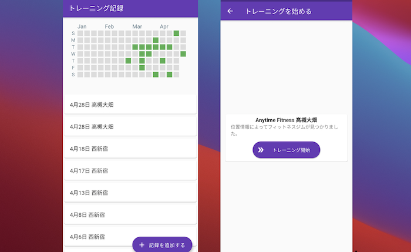

# Gymnote

トレーニングでのフィットネスジム通いの頻度を可視化するスマートフォンアプリ

githubプロフィールで表示される日々のコントリビューション(草を生やすやつ)のグラフのように可視化することでモチベーションアップをねらう。



## TODO
- [x] データ保存ロジック
- [x] トレーニング記録の表示
- [x] トレーニング記録のグラフ表示
- [x] 連続して記録が追加できないように時間の間隔を設ける
- [x] データの追加
- [x] 位置情報判定ロジックの修正
- [ ] 作成された新規データが一覧に表示されない。データ更新のタイミング

## 保存データ形式

永続化させるデータの種類は、「フィットネスジムへの来訪記録」の一種類のみ。
#### トレーニング記録(gym_visit)フィールド
- locationId: フィットネスジム店舗のID
- locationName: 場所名
- date: 来訪時間

アプリケーション内で記録されたデータはAndroidスマホのローカルストレージに保存する。
保存するデータは以下のような`json`形式
```json
{
    "gym_visit": [
        {
            "date": "2021-01-01T18:25:43.511Z",
            "locationId": "100012",
            "locationName": "京都五条",
        }
    ]
}
```

## 詰まった点

- エミュレータでのデバッグでlocation.getLocationで位置情報の更新がされない。デバッグ機能no
画面では位置情報の値を更新しているが、getLocationから返却される値は元のまま
- Columnの中で`ListView`を使用するとエラーが発生する [解決方法](https://qiita.com/tabe_unity/items/4c0fa9b167f4d0a7d7c2)
- `floatingActionButton`のdisable切り替えの適切な方法がわからない。とりあえずの対策として、ローディング中は`onPressed`の値を`null`としている。

## 参考URL

- [Flutterで始めるアプリ開発](https://www.flutter-study.dev/widgets/about-widget)
- [Flutter環境構築 Mac M1 (Apple Silicon) 版](https://zenn.dev/hndr/articles/14689ec937af1f)